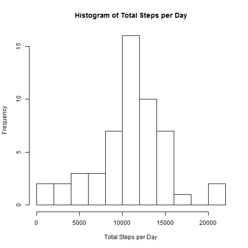
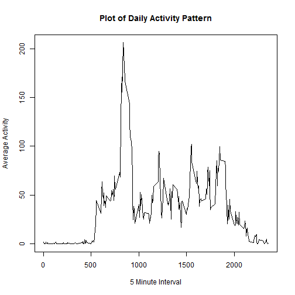
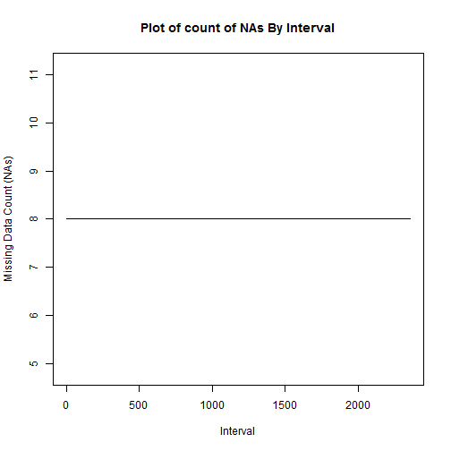
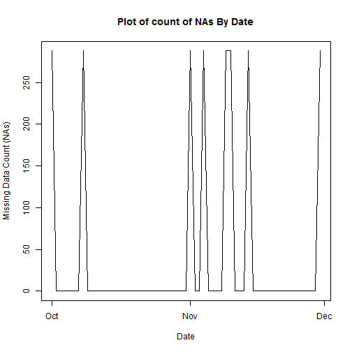
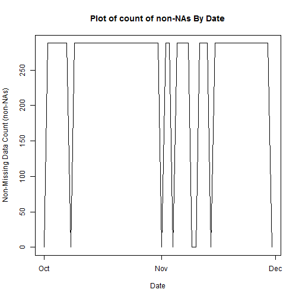
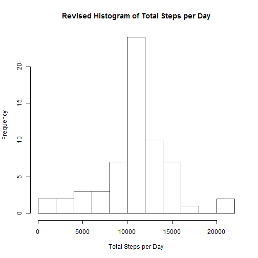
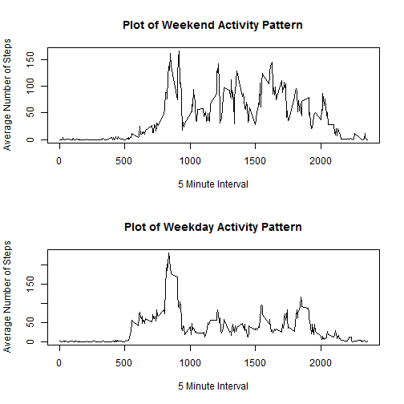

---
output:
  html_document:
    keep_md: yes
---
# Reproducible Research: Peer Assessment 1


## Loading and preprocessing the data  


```r
require(utils)
## For this project assume the working directory is set to where this file resides and should not be changed.
## The local repo directory is C:\Courses\repos\DataScience\RepData_PeerAssessment1
getwd()
```

```
## [1] "C:/Courses/Data Science/Reproducible Research/Project1"
```

```r
## NOTE: The GitHub repository also contains the dataset for the assignment so 
## you do not have to download the data separately.
## Unzip the file and set the datafile variable to the name of the extracted file.
zipfile <- "activity.zip"
unzipfiles <- unzip(zipfile,list=TRUE)
datafile <- unzipfiles$Name[1]
## extract the file from the zip file.
unzip(zipfile,exdir = ".")
## Load the specified file into a data frame and prepare it for use.
df <- read.csv(datafile,colClasses=c("integer","Date","integer"))
str(df)
```

```
## 'data.frame':	17568 obs. of  3 variables:
##  $ steps   : int  NA NA NA NA NA NA NA NA NA NA ...
##  $ date    : Date, format: "2012-10-01" "2012-10-01" ...
##  $ interval: int  0 5 10 15 20 25 30 35 40 45 ...
```

## What is mean total number of steps taken per day?

The instructions state: "For this part of the assignment, you can ignore 
the missing values in the dataset."  

Since the metric to be calculated is the total, any day with NAs would 
bias the total downward so those days will be ignored.  

Steps to implement:   

1. when calculating use na.rm=FALSE which is the default so that the days with 
NAs will return a value of NA.
   
2. when calculating the mean and median of the totals, remove the NAs so that
the days with NAs are ignored.

#### 1. Make a histogram of the total number of steps taken each day

```r
require(graphics)
## df was created in chunk loaddata.
totals <- as.vector(by(df$steps,df$date,sum))

hist(totals, breaks=10,
     main="Histogram of Total Steps per Day",
     xlab="Total Steps per Day"
     )
```

 

#### 2. Calculate and report the mean and median total number of steps taken per day

```r
require(stats)
## totals was crated in chunk histSteps.
print(paste("Mean Total Steps: ",round(mean(totals,na.rm=TRUE))))
```

```
## [1] "Mean Total Steps:  10766"
```

```r
print(paste("Median Total Steps: ",median(totals,na.rm=TRUE)))
```

```
## [1] "Median Total Steps:  10765"
```

## What is the average daily activity pattern?

#### 1. Make a time series plot (i.e. type = "l") of the 5-minute interval (x-axis) and the average number of steps taken, averaged across all days (y-axis)

In this case NAs have to be treated differently because there is at
least one NA steps values associated with every interval value.
Therefore NAs need to be dropped immediately. This is OK because 
The average is not biased by dropping NAs in the same way as for the sum.

It seems strange to use interval as-is in a time series since the low-order
2-digits are minutes and the higher-order digits are hours so it looks like
military time with out the colon or leading zeroes. That means there is a
gap in the range between xx55 and yy00 with no data (yy=xx+1). However, that
is the form used in the sample provided in the Peer Assessment instructions.
Therefore interval will be used unmodified as it was in the example. This 
makes the transitions between hours somewhat visible in the line graph.


```r
require(graphics)
## df was created in chunk loaddata.
NoNAs <- df[!is.na(df$steps),]
intervals <- split(NoNAs[,c("steps","interval")], NoNAs$interval)
avgact <- lapply(intervals, function(x) colMeans(x["steps"]))

plot(names(avgact),avgact, type="l",
     main="Plot of Daily Activity Pattern",
     xlab="5 Minute Interval",
     ylab="Average Activity"
     )
```

 

#### 2. Which 5-minute interval, on average across all the days in the dataset, contains the maximum number of steps?


```r
## intervals and avgact were created in chunk plotactivity.
avgact2 <- sapply(intervals, function(x) colMeans(x["steps"]))
avgact2 <- data.frame(avgact2)
maxint <- avgact[which.max(avgact2$avgact2)]
print(paste("The interval with maximum average steps of",as.integer(maxint[1]),"is",names(maxint)))
```

```
## [1] "The interval with maximum average steps of 206 is 835"
```

## Imputing missing values

#### 1. Calculate and report the total number of missing values in the dataset (i.e. the total number of rows with NAs)

It has already been determined that there were no missing values for interval or date columns.
Therefore all NAs are for the steps variable.

```r
require(stats)
## df was created in chunk loaddata.
df$ok <- complete.cases(df)
print(paste("The total number of rows with NAs is ",sum(!df$ok)))
```

```
## [1] "The total number of rows with NAs is  2304"
```

#### 2. Devise a strategy for filling in all of the missing values in the dataset. The strategy does not need to be sophisticated. For example, you could use the mean/median for that day, or the mean for that 5-minute interval, etc.

First, what do we know about the distribution of NAs by interval or date?
The following plots and explanations are the basis for the decision that 
the strategy will be to replace missing values with the interval average.


```r
require(stats)
require(graphics)
## df was updated to include df$ok in chunk countmissing.
## Add df$nok (not OK) to mark rows with NA for easier counting.
df$nok <- !complete.cases(df)
## First look at missing values per interval.
## The plot is uniform since NAs are associated with all intervals of a day.
## In other words, days that have NAs have NAs for all intervals of the day.
nabyint <- split(df[,c("interval","nok")], df$interval)
naint <- lapply(nabyint, function(x) colSums(x["nok"]))
plot(names(naint),naint, type="l",
     main="Plot of count of NAs By Interval",
     xlab="Interval",
     ylab="Missing Data Count (NAs)"
     )
```

 

```r
## Next look at missing values per date.
## This plot shows all dates with NAs are missing 288 values.
nabydate <- split(df[,c("date","nok")], df$date)
nadate <- lapply(nabydate, function(x) colSums(x["nok"]))
plot(as.POSIXlt(names(nadate),"%Y-%m-%d", tz = "GMT"),nadate, type="l",
     main="Plot of count of NAs By Date",
     xlab="Date",
     ylab="Missing Data Count (NAs)"
     )
```

 

```r
## Next look at non-missing values per date.
## This plot shows that some dates have no non-NA values. Using
## the average for the date isn't useful since it will be 0 or NA
## for those days depending on how NAs in the source data are treated.
okbydate <- split(df[,c("date","ok")], df$date)
okdate <- lapply(okbydate, function(x) colSums(x["ok"]))
plot(as.POSIXlt(names(okdate),"%Y-%m-%d", tz = "GMT"),okdate, type="l",
     main="Plot of count of non-NAs By Date",
     xlab="Date",
     ylab="Non-Missing Data Count (non-NAs)"
     )
```

 

#### 3. Create a new dataset that is equal to the original dataset but with the missing data filled in.

Steps for replacing missing values with the interval average:  

1. Duplicate df data set to create data set with replacement values.

2. Create a data frame of the average steps per interval. This is
done easier starting with the existing avgact list created above 
for the daily activity plot.

3. Create a function that will replace NA with the value from
the array created in 2 (average steps per interval).

4. Use apply to add the newsteps column with the new steps values.


```r
## Start with the dataset df updated by chunk NAstrategy.
## 1. Duplicate df data set to create data set with replacement values.
newdf <- df
## 2. Create a data frame of the average steps per interval. This is
##    done easier starting with the existing avgact list created above 
##    for the daily activity plot.
intavg <- data.frame(interval=as.integer(names(avgact)),avgsteps=unlist(avgact))

## 3. Create a function that will replace NA with the value from
##    the data frame created in 2 (average steps per interval).
useavg <- function(thedf,avg) {
        ifelse(thedf[5]==" TRUE",
               {subavg <- avg[avg$interval==as.integer(thedf[3]),]
                subavg$avgsteps},
               thedf[1]
               )
        }
## 4. Use apply to update the steps column with the new steps values.
newdf$steps <- as.integer(apply(newdf,1,useavg,intavg))
## Summary shows there are no longer any NAs.
summary(newdf$steps)
```

```
##    Min. 1st Qu.  Median    Mean 3rd Qu.    Max. 
##    0.00    0.00    0.00   37.33   27.00  806.00
```

#### 4. Make a histogram of the total number of steps taken each day and Calculate and report the mean and median total number of steps taken per day. 

First recreate the histogram using the new dataset.


```r
require(graphics)
## newdf was created in chunk newdataset.
newtotals <- as.vector(by(newdf$steps,newdf$date,sum))

hist(newtotals, breaks=10,
     main="Revised Histogram of Total Steps per Day",
     xlab="Total Steps per Day"
     )
```

 

Recalculate and report the mean and median total number of steps taken per day.


```r
require(stats)
## newtotals was crated in chunk newhistSteps.
print(paste("Revised Mean Total Steps: ",round(mean(newtotals,na.rm=TRUE))))
```

```
## [1] "Revised Mean Total Steps:  10750"
```

```r
print(paste("Revised Median Total Steps: ",median(newtotals,na.rm=TRUE)))
```

```
## [1] "Revised Median Total Steps:  10641"
```

#### Do these values differ from the estimates from the first part of the assignment? What is the impact of imputing missing data on the estimates of the total daily number of steps?

The histogram is changed so that the bar for the average is taller which 
is to be expected since filling in the NAs for 8 complete days with the
interval averages is expected to produce an average day.

Both the mean and the median are reduced only by a very small amount which is 
expected since adding more average days should not change the average by much.
The difference is a reduction of about 0.15% for the mean. The median was
reduced by a larger 1.15% since 8 additional days with average values lower
than the prior median were added to the list. Therefore it is reasonable that
this approach had a somewhat greater affect on the median than mean.

## Are there differences in activity patterns between weekdays and weekends?

For this part the weekdays() function may be of some help here. Use the dataset with the filled-in missing values for this part.

#### 1. Create a new factor variable in the dataset with two levels - "weekday" and "weekend" indicating whether a given date is a weekday or weekend day.


```r
## newdf dataset was created in chunk newdataset.
## Add the weekend/weekday factor variable.
newdf$wkendwkday <- as.factor(
        ifelse(weekdays(newdf$date)=="Sunday" | weekdays(newdf$date)=="Saturday", 
               "weekend",
               "weekday"
               )
        )
```

#### 2. Make a panel plot containing a time series plot (i.e. type = "l") of the 5-minute interval (x-axis) and the average number of steps taken, averaged across all weekday days or weekend days (y-axis). 


```r
## Depends on the version of newdf dataset updated in chunk weekdayfactor.
require(graphics)
wkdays <- newdf[newdf$wkendwkday=="weekday",]
wkdayints <- split(wkdays[,c("steps","interval")], wkdays$interval)
wkdayavgact <- lapply(wkdayints, function(x) colMeans(x["steps"]))

wkends <- newdf[newdf$wkendwkday=="weekend",]
wkendints <- split(wkends[,c("steps","interval")], wkends$interval)
wkendavgact <- lapply(wkendints, function(x) colMeans(x["steps"]))

par(mfcol = c(2, 1))
plot(names(wkendavgact),wkendavgact, type="l",
     main="Plot of Weekend Activity Pattern",
     xlab="5 Minute Interval",
     ylab="Average Number of Steps"
     )
plot(names(wkdayavgact),wkdayavgact, type="l",
     main="Plot of Weekday Activity Pattern",
     xlab="5 Minute Interval",
     ylab="Average Number of Steps"
     )
```

 

The panel plot shows that on weekdays the time of day with the highest activity is between 8:00 AM and 9:00 AM since it seems people are more likely to be exercising before work.  There is somewhat higher activity again after 3:30 PM.  Weekends still have the highest activity between 8:00 AM and 9:30 AM, but the peak is lower than for weekdays and there is higher activity throughout weekend days when compared to weekdays.
